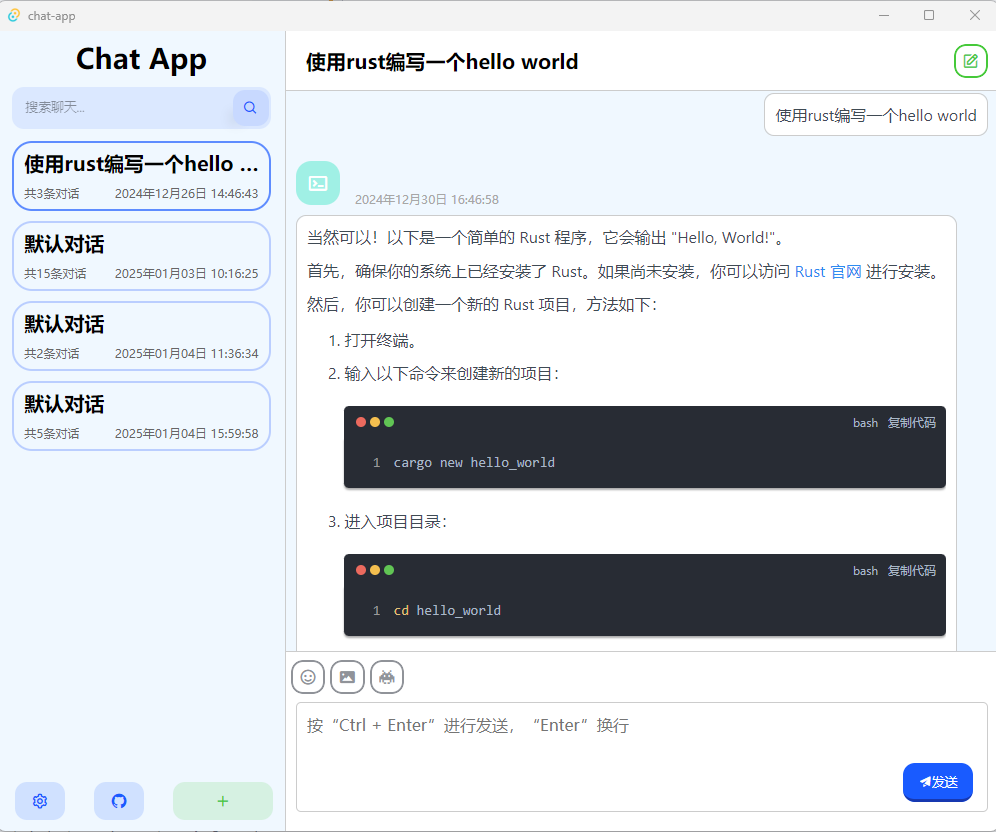
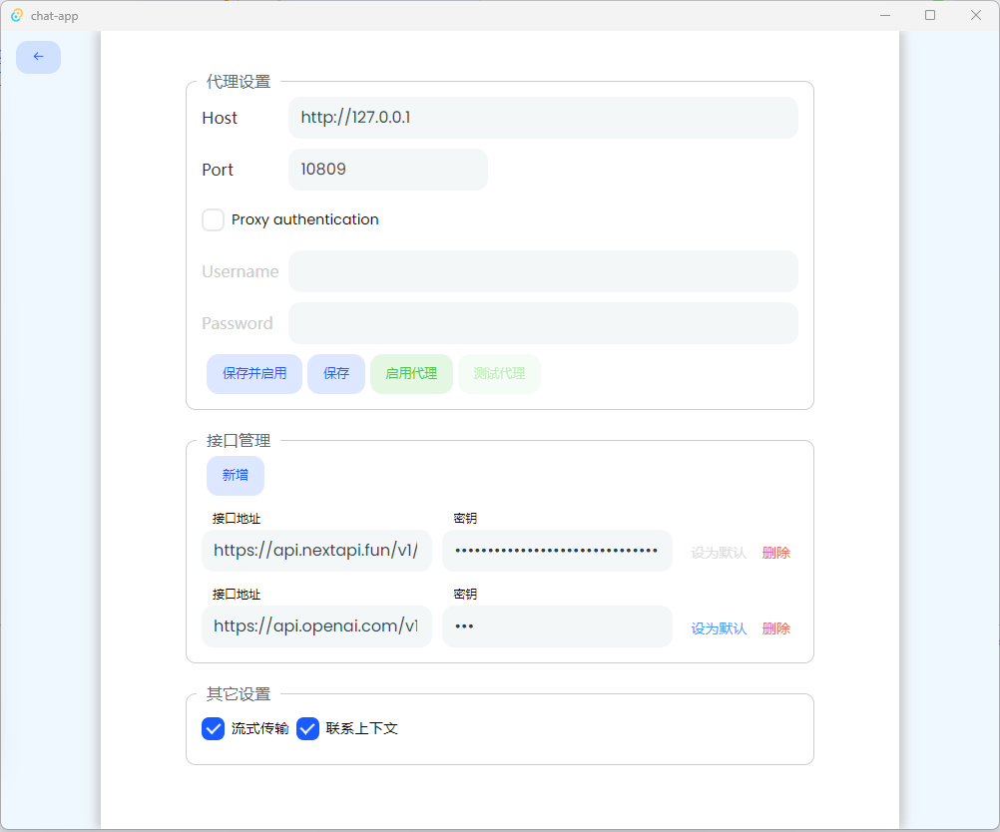

# ChatGpt聊天应用

一款UI仿照[ChatGPT-Next-Web](https://github.com/ChatGPTNextWeb/ChatGPT-Next-Web)项目，使用`Rust` + [`Tauri`](https://github.com/tauri-apps/tauri)框架搭建的简单AI聊天项目

**聊天界面：**

**设置界面：**

### 相关功能：

- [x] 自定义Api接口和密钥
- [x] 设置代理
- [x] 流式响应
- [x] 联系上下文
- [ ] 发送图片
- [ ] 自定义模型
- [ ] 自定义面具

> **NOTE：** 自定义API功能需要保证接口返回的数据结构和官方API返回的一致